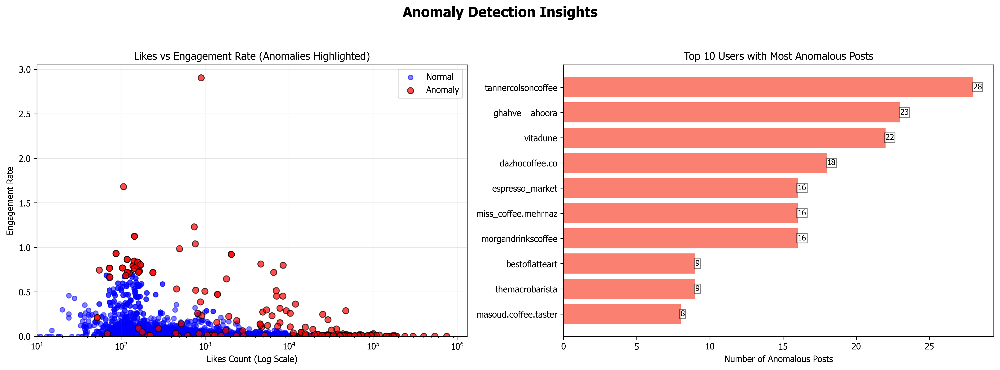
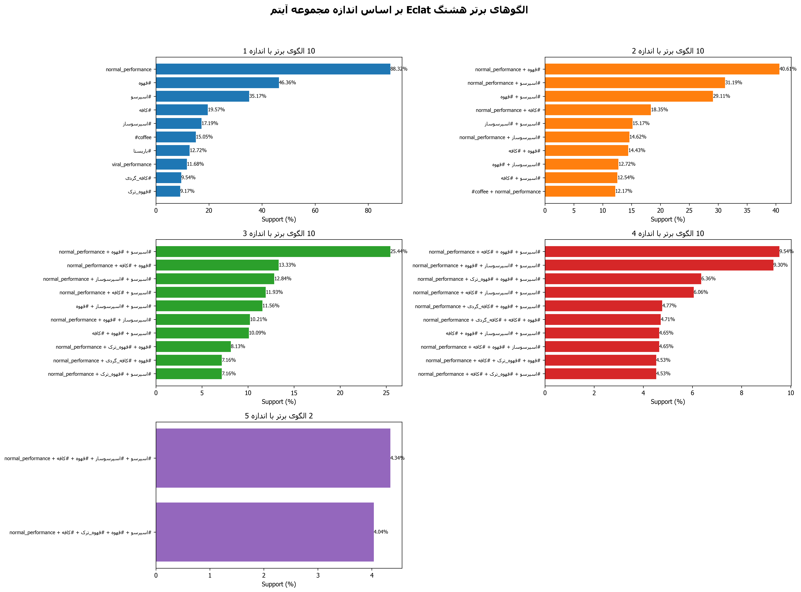
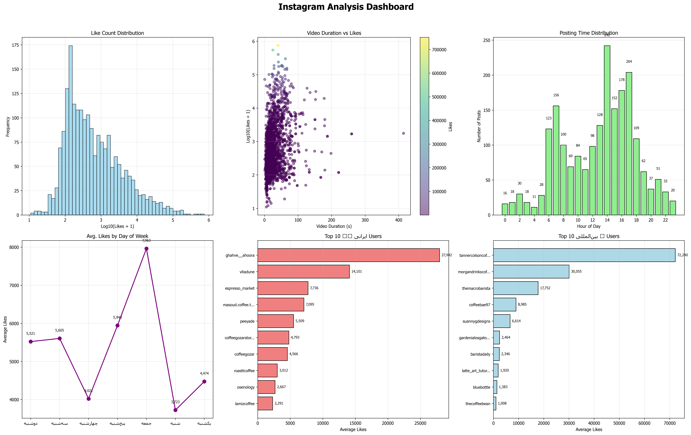
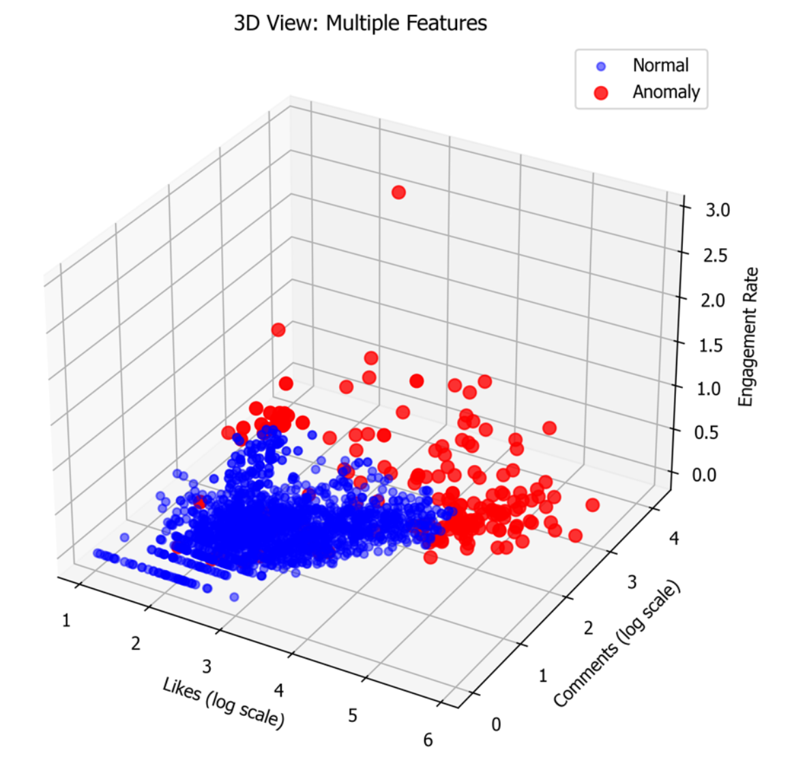

[](README_fa.md)

# Project Documentation: Instagram Data Analysis with ECLAT and Anomaly Detection

## 1. Project Overview  
This project is a comprehensive analysis tool for extracted Instagram data (especially video posts). Its main goal is to discover hidden patterns in user and content behaviors, identify anomalous posts and users, and detect potential fraud signals through a combination of data mining and machine learning techniques.

This system is specifically designed for analyzing Persian content and identifying Iranian users, providing its output in the form of textual reports and visual dashboards.

---

## 2. Main Objectives  

### Pattern Discovery:  
Using the ECLAT algorithm, frequent patterns are identified in three main areas:
- **Hashtag Patterns:** Which hashtags and combinations are most often used together?  
- **User Behavioral Patterns:** What common characteristics do successful users share (e.g., active times, engagement level)?  
- **Temporal Patterns:** On which days and times do posts perform best?

### Anomaly Detection:  
Using the Isolation Forest machine learning algorithm, outliers that differ from general data behavior are identified:
- **Anomalous Posts:** Posts with like, comment, or engagement rates that are very different from the average.  
- **Anomalous Users:** Users with suspicious activity patterns (e.g., sudden growth, very low activity but high engagement).  
- **Anomalous Content:** Posts with unusual content features (e.g., very short videos that go viral).

### Fraud Signal Detection:  
With specific rules and thresholds, users showing suspicious patterns (like buying likes or views) are identified.

### Reporting and Visualization:  
Presenting analytical results in detailed textual reports and understandable graphic dashboards for better decision-making.

---

## 3. Project Structure  

### `main.py`:  
- This file is the project’s main engine.  
- Includes the `InstagramECLATAnalyzer` class, which contains all logic for data loading, preprocessing, running algorithms, and generating outputs.

### `config.py`:  
- This file serves as the project’s configuration panel.  
- All parameters, file paths, column names, algorithm thresholds, and chart appearance settings are defined here. This design allows users to customize the project for various needs without changing the main code.

### `instagramData.xlsx`:  
- The input Excel file containing raw data extracted from Instagram.  
- The project reads data from the sheet whose name is specified in `config.py`.

## To access the N8N WorkFlow designed for data extraction, visit the link below

- [N8N WorkFlow](https://github.com/AttackThwarter/note-repo/blob/main/automation/N8N/instagramScraper)

## For running N8N via Google Colab for free, together with LLM setup, use the link below

- [N8N GoogleColab](https://github.com/AttackThwarter/note-repo/blob/main/AI/google_colab/N8N)

---

## 4. Methodology

### Step 1: Data Loading & Preprocessing  
- Data is loaded from the Excel file specified in `config.py`.  
- Numeric columns (like likes and comments) are converted to numeric types, and invalid values are replaced with zero.  
- Posts with zero likes are excluded from the analysis.  
- **Nationality Detection:** By checking Persian keywords (`iranian_keywords`) and Persian alphabet letters in captions and hashtags, the user’s nationality is determined as "Iranian" or "International".  
- **Feature Engineering:** New features like hour, weekday, and like categorization (e.g., 'Viral', 'High', 'Medium') are created for better analysis.

### Step 2: Pattern Analysis with the ECLAT Algorithm  
This algorithm is used to find "Frequent Itemsets":

## The reason for choosing this algorithm is explained by testing 3 similar algorithms, as documented in this repository

- [data_analysis_project](https://github.com/AttackThwarter/python_ex/tree/master/data_analysis_project)

<br>

- **Hashtag Analysis:** Finds frequently co-occurring hashtag combinations.  
- **User Analysis:** Categorizes user profiles based on characteristics like "high/medium/low activity" and "high/medium/low engagement", identifying common patterns.  
- **Temporal Analysis:** Reveals posting time patterns (e.g., "morning post + Friday + high performance").

### Step 3: Anomaly Detection with Isolation Forest  
- This is an unsupervised learning algorithm for detecting outliers.  
- It is run on three feature sets to identify anomalous posts, users, and content.  
- Each item is assigned an "Anomaly Score"—the lower the score, the more anomalous the item.

### Step 4: Fraud Signal Detection  
This section is rule-based:
- **Suspicious Like Consistency:** Users whose post like counts are very close to each other (bot-like behavior).  
- **Like-to-Play Ratio:** Users whose likes are unreasonably higher than video views.  
- **Play-to-Like Ratio:** Users with very high views but very few likes (suspected of buying views).  
- **Sudden Like Variations:** Users with large differences in likes across posts (suspected of buying likes intermittently).

### Step 5: Output Generation 

### To view sample output results, see the file [```results_20250606_234741```](results_20250606_234741/) in this repository

- **Text Reports (.txt):** For each of the anomaly and fraud analyses, a detailed report is produced. A main and a final summary report are also generated.  
- **Visualizations (.png):** Four dashboard graphics are generated to visually display results.

## Sample Analytical Charts 

 

 

 

 

## Question: Why did the algorithm highlight red points among the blue points in `Likes vs Engagement Rate (Anomalies Highlighted)` in the `anomaly_specific_plots.png` chart?

### Answer: Because anomaly detection in this algorithm depends on various factors, and not all features can be displayed in two-dimensional space (as the image below shows).

 
---
---

## 5. Installation and Execution Guide  

### Prerequisites:  
First, install the required Python libraries with the following command (you may use venv):

```bash
pip install pandas numpy matplotlib seaborn scikit-learn arabic_reshaper python-bidi openpyxl
```

### Configuration (`config.py`):  
Before running, open `config.py` and set the following parameters as needed:
- `EXCEL_FILE_PATH`: Path to the input Excel file.  
- `SHEET_NAME`: Name of the sheet containing the data.  
- `MIN_SUPPORT`: Minimum ECLAT algorithm support threshold (e.g., `0.04` means at least 4% frequency).  
- `IFOREST_CONTAMINATION`: Estimated percentage of anomalies for Isolation Forest algorithm (usually between `0.05` and `0.1`).  
- `FONT_NAME_FOR_PERSIAN`: Name of a Persian font installed on your system (like `'Tahoma'` or `'B Nazanin'`) for correct Persian text display in charts.

### Execution:  
To execute the full analysis process, just run `main.py`:

```bash
python main.py
```

After execution, a new folder `results_{TIME STAMP}` will be created containing all outputs.

---

## 6. Output Files Description  
Outputs are organized in a timestamped folder with the following subdirectories:

### `eclat_results/`:
- `patterns/`: ECLAT pattern text reports by size (e.g., `patterns_size_2.txt`).  
- `reports/`:
  - `eclat_analysis_report.txt`: Main report summarizing top patterns found in each domain (hashtag, user, time).

### `isolation_forest_results/`:
- `anomalous_posts_report.txt`: List of posts identified as anomalous with details.  
- `anomalous_users_report.txt`: List of anomalous users with their statistical metrics.  
- `content_anomalies_report.txt`: List of posts with unusual content.  
- `fraud_signals_report.txt`: Report of users suspected of fraud based on defined rules.

### `visualizations/`:
- `instagram_analysis_dashboard.png`: Main dashboard with like distribution, relation of likes to video length, post timing, and top Iranian/international users.  
- `instagram_overview_dashboard.png`: Overview dashboard: top users, nationality distribution, performance categories, most popular hashtags.  
- `anomaly_specific_plots.png`: Specialized anomaly plots comparing normal/abnormal posts and showing users with most anomalous posts.  
- `eclat_patterns_visualization.png`: ECLAT pattern chart displaying top hashtag patterns by size.

### Main file in the results folder root:  
- `summary_report_[timestamp].txt`: A comprehensive summary report of all results, key stats, top findings, and links to all other output files. Start with this file for an overview.

---

## 7. Dependencies and Technologies  
- **Python 3.10.6**  
- **Pandas:** For data manipulation and working with DataFrames.  
- **NumPy:** For numerical operations.  
- **Scikit-learn:** For the IsolationForest implementation.  
- **Matplotlib & Seaborn:** For data plotting and visualization.  
- **Arabic Reshaper & Python-Bidi:** For proper display of Persian text in charts.


<br><br>
If you have any questions, ask here :) 👇

## [chat](https://github.com/AttackThwarter/note-repo/discussions/1)
