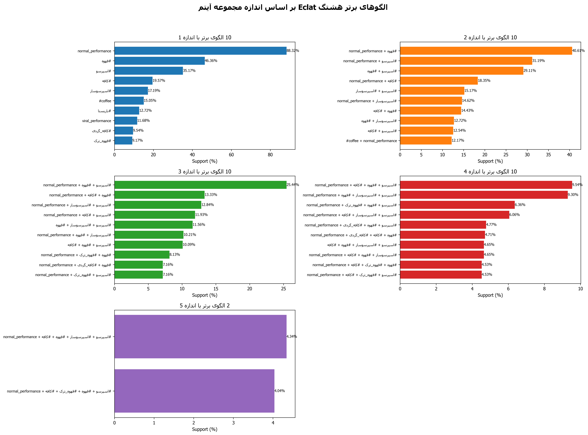
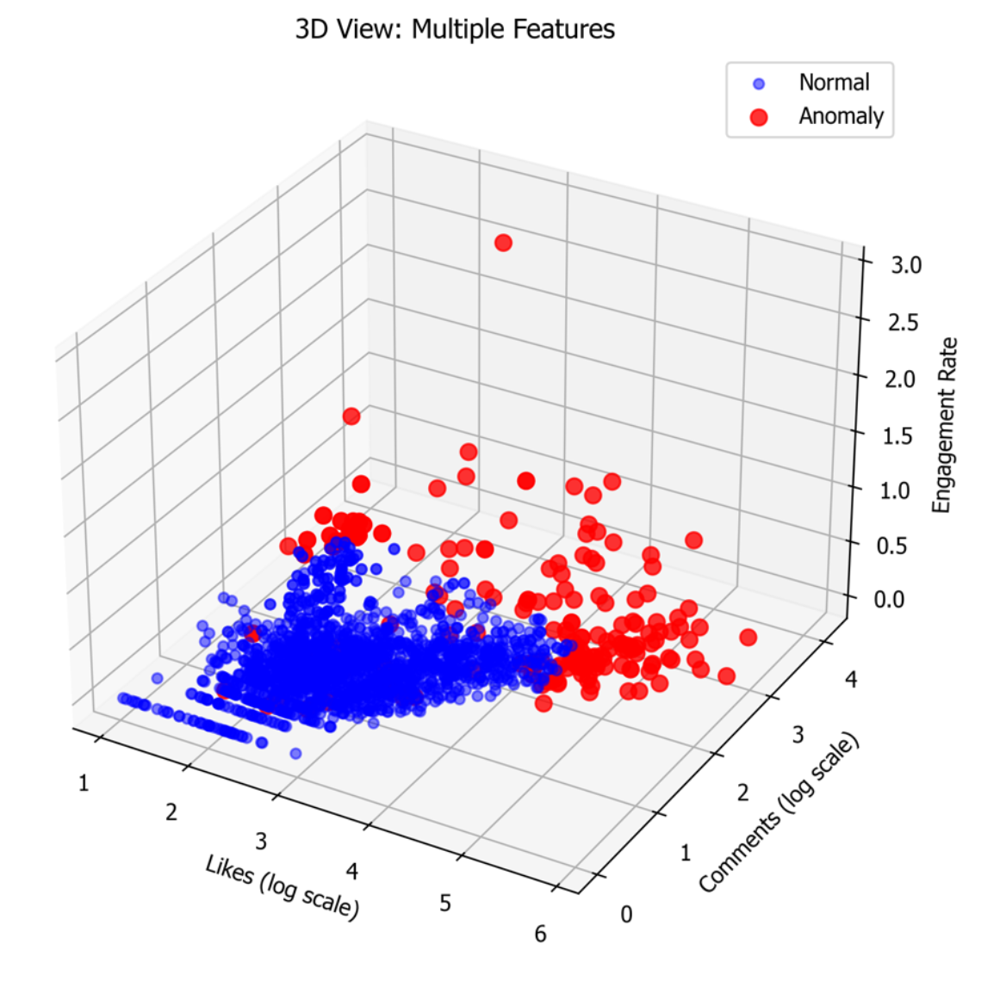

[](README.md)


# مستندات پروژه: تحلیل داده‌های اینستاگرام با ECLAT و شناسایی ناهنجاری

 

 
## 1. معرفی کلی پروژه  
این پروژه یک ابزار تحلیلی جامع برای داده‌های استخراج‌شده از اینستاگرام (به‌ویژه پست‌های ویدیویی) است. هدف اصلی آن، کشف الگوهای پنهان در رفتار کاربران و محتوا، شناسایی پست‌ها و کاربران ناهنجار و همچنین تشخیص سیگنال‌های بالقوه تقلب (Fraud) از طریق ترکیبی از تکنیک‌های داده‌کاوی و یادگیری ماشین است.
 
این سیستم به‌طور خاص برای تحلیل محتوای فارسی و شناسایی کاربران ایرانی طراحی شده و خروجی‌های خود را در قالب گزارش‌های متنی و داشبوردهای تصویری ارائه می‌دهد.
 
---
 
## 2. اهداف اصلی  
 
### کشـف الگو (Pattern Discovery):  
با استفاده از الگوریتم ECLAT، الگوهای پرتکرار در سه حوزه اصلی شناسایی می‌شوند:
- **الگوهای هشتگ:** کدام هشتگ‌ها و ترکیب‌هایی از آن‌ها بیشتر با هم استفاده می‌شوند؟  
- **الگوهای رفتاری کاربر:** کاربران موفق چه ویژگی‌های مشترکی دارند (مثلاً زمان فعالیت، میزان تعامل)؟  
- **الگوهای زمانی:** پست‌ها در چه روزها و ساعت‌هایی بیشترین بازدهی را دارند؟
 
### شناسایی ناهنجاری (Anomaly Detection):  
با استفاده از الگوریتم یادگیری ماشین Isolation Forest، موارد غیرعادی که با رفتار کلی داده‌ها تفاوت دارند، شناسایی می‌شوند:
- **پست‌های ناهنجار:** پست‌هایی با لایک، کامنت یا نرخ تعامل بسیار متفاوت از میانگین.  
- **کاربران ناهنجار:** کاربرانی با الگوهای فعالیت مشکوک (مانند رشد ناگهانی، فعالیت بسیار کم اما تعامل بالا).  
- **محتوای ناهنجار:** پست‌هایی با ویژگی‌های محتوایی غیرمعمول (مثلاً ویدیوی بسیار کوتاه اما وایرال شده).
 
### تشخیص سیگنال‌های تقلب (Fraud Signal Detection):  
با استفاده از قوانین و آستانه‌های مشخص، کاربرانی که الگوهای مشکوک به تقلب (مانند خرید لایک یا ویو) از خود نشان می‌دهند، شناسایی می‌شوند.
 
### تولید گزارش و مصورسازی:  
ارائه نتایج تحلیل در قالب گزارش‌های متنی دقیق و داشبوردهای گرافیکی قابل فهم برای تصمیم‌گیری بهتر.
 
---
 
## 3. ساختار پروژه  
 
### `main.py`:  
- این فایل، موتور اصلی پروژه است.  
- شامل کلاس `InstagramECLATAnalyzer` است که تمام منطق‌های مربوط به بارگذاری داده، پیش‌پردازش، اجرای الگوریتم‌ها، و تولید خروجی‌ها را در خود جای داده است.
 
### `config.py`:  
- این فایل به عنوان پنل تنظیمات پروژه عمل می‌کند.  
- تمام پارامترها، مسیر فایل‌ها، نام ستون‌ها، آستانه‌های الگوریتم‌ها و تنظیمات ظاهری نمودارها در این فایل تعریف شده‌اند. این طراحی به کاربر اجازه می‌دهد تا بدون دستکاری کد اصلی، پروژه را برای نیازهای مختلف سفارشی‌سازی کند.
 
### `instagramData.xlsx`:  
- فایل اکسل ورودی که حاوی داده‌های خام استخراج‌شده از اینستاگرام است.  
- پروژه داده‌ها را از شیتی که نام آن در `config.py` مشخص شده، می‌خواند.
 
---
 
## 4. نحوه عملکرد (Methodology)
 
### مرحله ۱: بارگذاری و پیش‌پردازش داده‌ها (Data Loading & Preprocessing)  
- داده‌ها از فایل اکسل مشخص‌شده در `config.py` بارگذاری می‌شوند.  
- ستون‌های عددی (مانند لایک و کامنت) به نوع عددی تبدیل و مقادیر نامعتبر با صفر جایگزین می‌شوند.  
- پست‌هایی که هیچ لایکی ندارند، از تحلیل حذف می‌شوند.  
- **تشخیص ملیت:** با بررسی کلمات کلیدی فارسی (`iranian_keywords`) و حروف الفبای فارسی در کپشن و هشتگ‌ها، ملیت کاربر به عنوان "Iranian" یا "International" مشخص می‌شود.  
- **مهندسی ویژگی:** ویژگی‌های جدیدی مانند ساعت، روز هفته و دسته‌بندی لایک (مثلاً 'Viral', 'High', 'Medium') برای تحلیل بهتر ایجاد می‌شوند.
 
### مرحله ۲: تحلیل الگو با الگوریتم ECLAT  
این الگوریتم برای یافتن "مجموعه آیتم‌های پرتکرار" (Frequent Itemsets) به کار می‌رود:
- **تحلیل هشتگ:** ترکیب هشتگ‌هایی که به طور مکرر با هم استفاده می‌شوند را پیدا می‌کند.  
- **تحلیل کاربر:** پروفایل کاربران را بر اساس ویژگی‌هایی مانند "فعالیت بالا/متوسط/کم" و "تعامل بالا/متوسط/کم" دسته‌بندی کرده و الگوهای رایج را شناسایی می‌کند.  
- **تحلیل زمانی:** الگوهای زمانی پست‌گذاری (مثلاً "پست صبح + روز جمعه + عملکرد بالا") را کشف می‌کند.
 
### مرحله ۳: شناسایی ناهنجاری با Isolation Forest  
- این یک الگوریتم یادگیری بدون ناظر (Unsupervised) است که داده‌های پرت و غیرعادی را شناسایی می‌کند.  
- این الگوریتم بر روی سه مجموعه ویژگی مجزا اجرا می‌شود تا پست‌ها، کاربران و محتوای ناهنجار را شناسایی کند.  
- به هر آیتم یک "امتیاز ناهنجاری" (Anomaly Score) اختصاص داده می‌شود که هرچه کمتر باشد، آیتم ناهنجارتر است.
 
### مرحله ۴: شناسایی سیگنال‌های تقلب  
این بخش مبتنی بر قوانین (Rule-based) است:
- **ثبات مشکوک لایک‌ها:** کاربرانی که لایک‌های پست‌هایشان بسیار به هم نزدیک است (رفتار ربات‌گونه).  
- **نسبت لایک به بازدید (Like-to-Play Ratio):** کاربرانی که تعداد لایک‌هایشان به شکل نامعقولی بیشتر از بازدید ویدیو است.  
- **نسبت بازدید به لایک (Play-to-Like Ratio):** کاربرانی که بازدیدهای بسیار بالایی دارند اما لایک کمی دریافت می‌کنند (مشکوک به خرید ویو).  
- **تغییرات شدید لایک:** کاربرانی که اختلاف لایک بین پست‌هایشان بسیار زیاد است (مشکوک به خرید لایک مقطعی).
 
### مرحله ۵: تولید خروجی‌ها 

### برای مشاهده نمونه نتایج خروجی میتوانید به فایل [```results_20250606_234741```](results_20250606_234741/) موجود در همین Repository مراجعه کنید

- **گزارش‌های متنی (.txt):** برای هر یک از تحلیل‌های ناهنجاری و تقلب، یک گزارش دقیق تولید می‌شود. همچنین یک گزارش اصلی و یک گزارش خلاصه‌شده نهایی نیز ایجاد می‌گردد.  
- **مصورسازی‌ها (.png):** چهار داشبورد گرافیکی برای نمایش بصری نتایج تولید می‌شود.


## نمونه نمودار های تحلیلی 

 

 

 

 


 ## پرسش: چرا در فایل `anomaly_specific_plots.png` در نمودار `Likes vs Engagement Rate (Anomalies Highlighted)` در عمق نقاط آبی، الگوریتم isolation forest نقاط قرمزی را مشخص کرده؟

 ### پاسخ : زیرا تشخیص ناهنجاری در این الگوریتم به موارد مختلفی بستگی دارد و در فضای دو بعدی امکان نمایش همه فیچر ها وجود ندارد (در تصویر زیر میتوان این موضوع را مشاهده کرد)

 
---
---
 
## 5. راهنمای نصب و اجرا  
 
### پیش‌نیازها:  
ابتدا کتابخانه‌های مورد نیاز پایتون را با دستور زیر نصب کنید: (میتواتید از venv استفاده کنید)
 
```bash
pip install pandas numpy matplotlib seaborn scikit-learn arabic_reshaper python-bidi openpyxl
```
 
### پیکربندی (`config.py`):  
قبل از اجرا، فایل `config.py` را باز کرده و پارامترهای زیر را مطابق با نیاز خود تنظیم کنید:
- `EXCEL_FILE_PATH`: مسیر فایل اکسل ورودی.  
- `SHEET_NAME`: نام شیتی که داده‌ها در آن قرار دارند.  
- `MIN_SUPPORT`: حداقل آستانه پشتیبانی برای الگوریتم ECLAT. (مثلاً `0.08` به معنی حداقل ۸٪ تکرار).  
- `IFOREST_CONTAMINATION`: درصد تخمینی داده‌های ناهنجار برای الگوریتم Isolation Forest (معمولاً بین `0.05` تا `0.1`).  
- `FONT_NAME_FOR_PERSIAN`: نام یک فونت فارسی نصب‌شده روی سیستم شما (مانند `'Tahoma'` یا `'B Nazanin'`) برای نمایش صحیح متون فارسی در نمودارها.
 
### اجرا:  
برای اجرای کامل فرآیند تحلیل، کافی است فایل `main.py` را اجرا کنید:
 
```bash
python main.py
```
 
پس از اتمام اجرا، یک پوشه جدید با نام `results_YYYYMMDD_HHMMSS` ایجاد می‌شود که تمام خروجی‌ها در آن قرار دارند.
 
---
 
## 6. شرح فایل‌های خروجی  
خروجی‌ها در پوشه‌ای با مهر زمانی (timestamp) در زیرشاخه‌های زیر سازماندهی می‌شوند:
 
### `eclat_results/`:
- `patterns/`: گزارش‌های متنی الگوهای ECLAT به تفکیک اندازه (مثلاً `patterns_size_2.txt`).  
- `reports/`:
  - `eclat_analysis_report.txt`: گزارش اصلی که خلاصه‌ای از برترین الگوهای یافت‌شده در هر سه حوزه (هشتگ، کاربر، زمانی) را ارائه می‌دهد.
 
### `isolation_forest_results/`:
- `anomalous_posts_report.txt`: لیست پست‌های شناسایی‌شده به عنوان ناهنجار به همراه جزئیات.  
- `anomalous_users_report.txt`: لیست کاربران ناهنجار به همراه معیارهای آماری آن‌ها.  
- `content_anomalies_report.txt`: لیست پست‌هایی که محتوای غیرعادی دارند.  
- `fraud_signals_report.txt`: گزارش کاربرانی که بر اساس قوانین تعریف‌شده، مشکوک به تقلب هستند.
 
### `visualizations/`:
- `instagram_analysis_dashboard.png`: داشبورد اصلی (2x3) شامل توزیع لایک، ارتباط لایک با طول ویدیو، زمان‌بندی پست‌ها و کاربران برتر ایرانی و بین‌المللی.  
- `instagram_overview_dashboard.png`: داشبورد نمای کلی (2x2) شامل برترین کاربران، پراکندگی ملیت، دسته‌بندی عملکرد و محبوب‌ترین هشتگ‌ها.  
- `anomaly_specific_plots.png`: نمودارهای ویژه ناهنجاری (1x2) که پست‌های عادی و ناهنجار را مقایسه کرده و کاربرانی با بیشترین تعداد پست ناهنجار را نمایش می‌دهد.  
- `eclat_patterns_visualization.png`: نمودار الگوهای ECLAT که برترین الگوهای هشتگ را به تفکیک اندازه نمایش می‌دهد.
 
### فایل اصلی در ریشه پوشه نتایج:  
- `summary_report_[timestamp].txt`: یک گزارش جامع و خلاصه‌شده از تمام نتایج، آمار کلی، برترین یافته‌ها و مسیر تمام فایل‌های خروجی دیگر. برای یک دید کلی، ابتدا این فایل را مطالعه کنید.
 
---
 
## 7. وابستگی‌ها و تکنولوژی‌ها  
- **Python 3.10.6**  
- **Pandas:** برای دستکاری و تحلیل داده‌ها.  
- **NumPy:** برای عملیات عددی.  
- **Scikit-learn:** برای پیاده‌سازی الگوریتم IsolationForest.  
- **Matplotlib & Seaborn:** برای تولید نمودارها و مصورسازی داده‌ها.  
- **Arabic Reshaper & Python-Bidi:** برای نمایش صحیح حروف فارسی در نمودارها.  
- **Openpyxl:** برای خواندن فایل‌های اکسل.